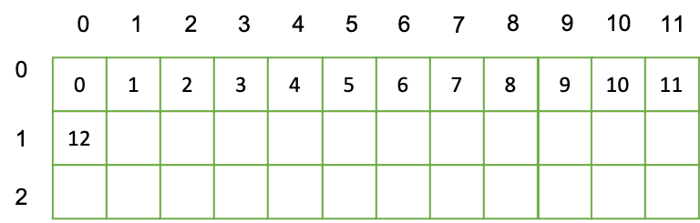

# Link to GitHub repository and GitHub Pages

The source code notebooks, as well as the output files for the individual questions have been uploaded to the following GitHub repository:

[https://github.com/kkkaslikar/AY20_MBDS_questions](https://github.com/kkkaslikar/AY20_MBDS_questions)

In addition, the rendered notebooks explaining the code and the approach are hosted at the following page:

[https://kkkaslikar.github.io/AY20_MBDS_questions/](https://kkkaslikar.github.io/AY20_MBDS_questions/)

The rest of this document contains answers to the questions that had to be provided separately.

# Question 7

This section contains the derivations for the equations to interconvert between index to coordinates and coordinates to index. For the actual code, please visit 

## Conventions and definitions

By the **convention given in the question sheet** itself, $x1$ = column coordinate and $x2$ = row coordinate. Hence, a cell with coordinates $[x1, x2]$ lies in the column $x1$ and row $x2$. Please note that this is **different from the usual convention** of writing the number of rows first, followed by the number of columns when giving the coordinates.


Let $ndim$ be a list of the length of the dimensions, where $ndim$ = [$L_1$ = length($x_1$), $L_2$ = length($x_2$)]. Hence, an array with 3 rows and 4 columns will have $L_1 = 4$ and $L_2 = 3$, and its $ndim$ will be [4, 3].

## Question 7.1a: Derivation for two dimensions

### Coordinates-to-index

Consider the following grid with ndim [12, 3].




While moving from one index to the next in the first row, the column coordinate $x_1$ increments by 1, while row coordinate stays the same. The cell at coordinate [11, 0] has index 11. On the other hand, the cell at coordinate [0, 1] has index 12. Hence, when we move to an index in the next row, the counter for the column coordinate $x_1$ resets to 0, while the row coordinate $x_2$ increments by one. In other words, incrementing the index by 12 units causes the row coordinate to increase by one while the the column coordinate resets to 0 (only if $ndim = [12, x_2]$, with $x_2$ having variable values). Hence, index 15 would be at coordinates [3, 1], since the column coordinate $x_1$ resets to 0 at index 12, the row coordinate increments by 1, followed by the column coordinate incrementing by 3.

This is functionally similar to how units of measure operate in the real world. Consider measuring length in the Imperial units of inches and feet, where 1 foot = 12 inches. Hence, to express a length of 11 inches, we would simply write 11 inches, but to express a length of 12 inches, we would have to write it as 1 foot 0 inches, and for 15 inches we would write 1 foot 3 inches. If we expressed these lengths in a manner similar to our coordinates, $x_2$ would be equal to length in feet, $x_1$ would be equal to the remaining length in inches, and the index would be equal to the total length in terms of inches. To find the total length in terms of inches, we would simply have to multiply the length in feet with 12 (the conversion factor) and add up the remaining length in inches.

In other words,

$$
\text{Total length in inches} = 12 * (\text{length in feet})  + (\text{remaining length in inches})
$$

$$
15 = 12*1 + 3
$$
 
To express this in the same manner as our coordinates, index 15 = 15 inches would be expressed as [3 inches, 1 foot] (note the reversed order). $L_1$ = 12 would act as a conversion factor to allow conversion from lengths given as [inches, feet] (coordinates) to lengths given purely in inches (index).

Hence, the equation to go from coordinates to index for the two-dimensional case is given by 

$$
index = L_1*x_2 + x_1
$$

### Index-to-coordinates

To go from coordinates to index, we need to reverse the process performed above, except that instead of division we perform floor division (with floor division being denoted within $\lfloor$ and $\rfloor$).

$$
x_2 = \floor{\frac{index}{L_1}}
$$

$$x_1 = index - \floor{\frac{index}{L_1}}$$

## Derivation for n-dimensions

### Coordinates to index

Imagine the following two grids stacked up on top of each other (forming a three dimensional structure):


\begin{figure}[H]
\includegraphics{./grid2.png}
\caption{Three-dimensional grid}
\end{figure}

The filling up of all 12 columns in a row is equivalent to filling up of one row (12 inches = 1 feet). Hence, by the same logic, the filling up of all 3 rows in the grid is equivalent to the filling up of one entire grid (if $L_2 = 3$). If we stick with the previous analogy of units of measure, since 3 feet = 1 yard, this translates to the filling up of one grid being equal to 1 yard (since 3 feet = 1 yard). In this scenario, our third coordinate $x_3$ becomes the distance in yards. If given a distance as 1  yard, 1 foot, 1 inch, in terms of our coordinate convention it would be expressed as [1, 1, 1]. To go from this distance to a distance expressed purely in terms of inches (index), we would have to convert the number of yards first into inches (multiplying by conversion factors $L_2=3$ and $L_1$ = 12), add it into the number of feet converted into the number of inches (multiplying by conversion factor $L_1=12$), and add the remaining number of inches to this sum.

$$
49 = 3*12*1 + 12*1 + 1
$$

Thus, our equation to go from coordinates to index becomes

$$
index = L_2*L_1*x_3 + L_1*x_2 + x_1
$$


In general, for $n$ dimensions, the equation becomes

$$
index = \sum_{i=2}^{n}[(\prod_{k=1}^{i-1}L_k)*x_i] + x_1
$$

### Index to coordinates

Let the product lengths of all the dimensions until dimension k (from $L_1$ to $L_k$) be given by $p_k$. Hence, $p_{n-1}$ is given by $\prod_{k=1}^{n-1}L_k$

For converting from index to coordinates in the $n$-dimensional case, we first need to find the coordinate for the $n$^th^ dimension, which can be found by floor division of the index by the product of the lengths of all the dimensions before it ($p_n-1$).


$$
x_n = \floor{\frac{index}{\prod_{k=1}^{n-1}L_k}} = x_n = \floor{\frac{index}{p_{n-1}}}
$$

Then, the coordinates of the subsequent dimensions (n-1 to 1) have to be found in a step-by-step manner.

1. Find the remainder of the division of the index by $p_{n-1}$. Let this remainder be denoted by $r_{n-1}$. Hence,

$$
r_{n-1} = index - x_{n} * p_{n-1}
$$

2. Find $x_{n-1}$ by floor division of $r_{n-1}$ by the product of the lengths of all the dimensions before n-1 (i.e., $p_{n-2}$).

$$
x_{n-1} = \floor{\frac{r_{n-1}}{p_{n-2}}}
$$

Then, find $r_{n-2}$ as

$$
r_{n-2} = r_{n-1} - x_{n-1} * p_{n-2}
$$

Keep repeating this process for the subsequent dimensions, until you reach $x_2$

Finally, $x_1$ can be found by simply finding $r_1$

$$
x_1 = r_1 = r_2 - x_{2} * p_{1}
$$

# Question 8

First, recapitulating the equation for enzyme reactions:

$$
E + S \ce{<=>[k_1][k_2]} ES \ce{->[k_3]} E + P
$$


## Question 8.1

Assuming that [E], [S], [ES] and [P] denote the concentrations of the four species E, S, ES and P respectively, the rates of change of the four species are given by:

1. Substrate S

Since substrate is being consumed by the forward reaction 

$$E + S \ce{->[k_1]} ES$$
 
and is being produced by the reverse reaction 
 
 $$ES \ce{->[k_2]}E + S$$
 
the rate of change of substrate concentration with respect to time is affected by both these reactions. The overall rate of change is given by:

$$
\dv{[S]}{t} = k_2[ES] - k_1[E][S]
$$


2. Enzyme-substrate complex ES

The concentration of the complex ES is being affected by three reactions.
 
Production by the reaction

$$E + S \ce{->[k_1]} ES$$
 
Consumption by the reaction
 
$$ES \ce{->[k_2]}E + S$$

Consumption by the reaction 

$$ES \ce{->[k_3]}E + P$$
 
The overall rate of change is given by:

$$
\dv{[ES]}{t} = k_1[E][S] - k_2[ES] - k_3[ES] = k_1[E][S] - (k_2 + k_3)[ES]
$$

2. Product P

The concentration of the product P is affected by production in the reaction

$$ES \ce{->[k_3]}P$$
 
 The overall rate of change is given by:

$$
\dv{[P]}{t} = k_3[ES]
$$

2. Enzyme E

The concentration of the enzyme is affected by three reactions.

Consumption by the reaction

$$E + S \ce{->[k_1]} ES$$

Production by the reaction

$$ES \ce{->[k_2]} E + S$$
 
Production by the reaction

$$ES \ce{->[k_3]} E + P$$

$$
\dv{[E]}{t} = k_2[ES] + k_3[ES] - k_1[E][S] = (k_2 + k_3)[ES] - k_1[E][S]
$$


## Question 8.3

Importing library for plotting:

```{r}
library(ggplot2)
```


The initial velocity of reaction, $v_0$, is given by the equation [@voet_2013]:

$$
v_0 = \left(\dv{[P]}{t}\right)_{t=0} = k_3[ES] = \frac{k_3[E_T][S]}{K_M + [S]}
$$

where $K_M$ is the Michaelis constant given by:

$$
K_M = \frac{k_2 + k_3}{k1}
$$


Given that $k_1 = 100 \mu M/min$, $k_2 = 600/min$, and $k_3 = 150 /min$ (as given in question 8.2), the value of $K_M$ is given by:

```{r}
km <- (600 + 150)/100
km
```


$E_T$ is the total concentration of the enzyme (enzyme units present both in E and ES state). Since at $t = 0$, all of the enzyme is in the E state, $[E]_T = [E] = 1 \mu M$ (as given in question 8.2).


Let the following be the values of $[S]$ that we plot the initial velocity for, in terms of $\mu M$:

```{r}
s <- seq(1, 500, by = 1)
head(s)
```

Storing the values of $[E_T]$ and $k_3$ as variables:

```{r}
et <- 1
k3 <- 150
```

Defining function to calculate $v_0$:

```{r}
calc.v0 <- function(s, et=et, k3=k3, km=km){
  v0 <- (k3*et*s)/(km + s)
  return(v0)
}
```

Plotting the values of $v0$ 


```{r}
g <- ggplot(data = data.frame("s" = s), aes(x = s)) + 
  stat_function(fun = calc.v0, args = list("et" = et, "k3" = k3, "km"= km)) + 
  xlab(label =  "[S]") +
  ylab(label = expression(V[0]))
g
```

As can be seen from the plot, even for very high values of $[S]$, the value of $V_0$  asymptotically approaches the maximum value $V_m$, but does not quite reach it. It appears to be approaching a $V_m$ of 150.

When the enzyme is completely saturated by the substrate, $[ES] = [E]_T$, since all the enzyme units are in the ES state. At that stage, $[ES]$ will have the same value as the initial value of $[E]$, which is our case was given as $1 \mu M$.

Hence, an alternative method to calculate maximum velocity $V_{m}$ is by using the relationship we described above:

$$
v_0 = \left(\dv{[P]}{t}\right)_{t=0} = k_3[ES]
$$

At enzyme saturation, this will become

$$
V_{m} = k_3[E]_T
$$

Calculating the value of $V_m$ using this equation:


```{r}
vm <- k3*et
vm
```

As inferred from the plot, the curve was indeed asymptotically approaching a value of 150 $\mu M \cdot min^{-1}$.

```{r}
g + geom_hline(yintercept = 150, linetype = "dashed", colour = "red") +
  annotate(geom = "text", x = 30, y = 145, label = "V[max] == 150" ,parse = TRUE, size = 4, colour = "red")
```


