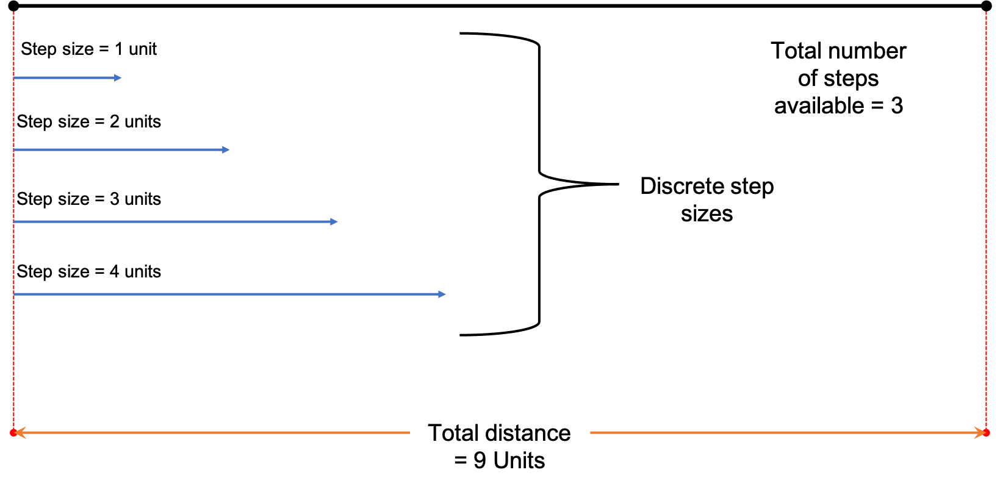

```{r echo = FALSE, results='hide'}
knitr::opts_chunk$set(tidy = TRUE)
getwd()
```

# Note about assumptions made

The following assumption has been made about the value of the elements of the matrix : if $i$ is the row coordinate and $j$ is the column coordinate of any element of the matrix, the value of elements $a_{i,j} = i$. In other words, the matrix is of the following type:

$$
\begin{bmatrix}
1 & 1 & 1 & 1\\
2 & 2 & 2 & 2\\
3 & 3 & 3 & 3\\
4 & 4 & 4 & 4\\
\end{bmatrix}
$$

However, the code is not meant to work if the value of the elements of the matrix do not follow the above pattern. For example, in the following case:

$$
\begin{bmatrix}
1 & 2 & 3 & 5\\
2 & 9 & 4 & 4\\
3 & 4 & 1 & 7\\
\end{bmatrix}
$$

# Approach

The first conclusion that can be made from the nature of the problem is that the number of downward steps (operations) = the number of rows - 1, and the number of rightward steps (operations) = the number of columns - 1. Furthermore, the total number of operations = number of rows + number of columns - 2 

Hence, for a matrix with m = 4 and n = 4, the number of downward operations = 3, number of rightward operations = 3, and the total number of operations = 6.

Looking at the nature of the problem, another thing that becomes clear is that for a matrix of given dimension, the contribution of the downward steps to the sum is **the same** regardless of what number is to be summed to.

For instance, consider the following matrix:

$$
\begin{bmatrix}
1 & 1 & 1 & 1\\
2 & 2 & 2 & 2\\
3 & 3 & 3 & 3\\
4 & 4 & 4 & 4\\
\end{bmatrix}
$$
No matter whatever objective number is to be summed to, to reach the bottom right from the top left, the sum will always contain $1+2+3+4=10$. Since this quantity is invariable, it does not contribute to the differences in solutions for different objective numbers, and hence can be removed from the total number to be summed to. The only factor that differentiates the solutions is the contribution of the rightward steps to the sum, which has to be solved for.

Consider the example given in the question sheet. Assuming that the matrix is as above, and the first number to be summed to is 19, then after removing the invariant portion of the sum (10), what remains is $16 - 10 = 9$. Hence, given this information, we have to determine how to reach the sum of 9 in number of rows -1 = 3 rightward operations. This problem can be rephrased as the following:

Given a specific distance (9), you *have* to reach that distance within a specific number of steps (3). In addition, the distance that you can cover in each step (hereafter called step size) can only take very specific values (in this case, the values are [1, 2, 3, 4], which are the row indices of the matrix). Which step sizes will you select for each step?

The problem can be visualised as below:


The logical thing to do would be to cover as much distance as possible in the first few steps by taking the maximum step size, but at the same time ensure that the remaining distance to cover can still be covered *exactly* within the remaining number of steps using the step sizes available to us. For instance, in this case, a distance of 9 can be reached by taking steps of size 4 within the first two steps ($2*4=8$), and cover the remaining 1 unit distance by taking the last step of size 1 unit.

Consider another number to be summed to: 16. In this case, once again we subtract the invariant portion $16-10=6$.

To cover a distance of 6 within 3 steps, we first take only one step with a distance of 4 (since taking one more step of size 4 would exceed the distance to be covered, and not even expend the total number of steps that have to be taken, i.e., 3). The size of the next step *has* to be 1, since the next smallest step size of 2 would cover the whole distance but would leave the one step remaining unused. The final step size is once again 1.

A simple way to prevent covering too much distance by taking $n$ steps of size $k$ is to consider the following question:

Is the distance remaining (referred to hereafter as $d_r$) after covering a distance of $n*k$ units equal to the number of steps remaining to be used? 

This is because if $d_r$ = remaining number of steps, then $d_r$ can be covered by simply taking $d_r$ steps of size 1. If this is not true, then we can try taking $n-1$ steps of size $k$ and check for this condition again, and keep going in this manner until we find the right number of steps to take of size $k$. If this number of steps is 0, then we can consider a smaller step size $k-1$ and retry the process all over again, until the condition becomes true.

Once we determine exactly how many steps of certain step sizes we should take we simply translate that to the rightward operations to perform. For instance, in the above case of reaching the number 19 (remaining distance of 9 after subtracting the contribution of the downward operations), the solution was to take two steps of size 4 and 1 step of size 1. This translates to two rightward operations in row 4 and one rightward operation in row 1, interspersed by downward operations.

The following code takes this approach.

# Code walk-through

This section works through the code for one example (Question 1a, the first number `65`).

The rest of the subquestions were solved using the same code as the one shown below.

## Library imports

```{r echo = TRUE, results='hide'}
library(stringr)

library(purrr)

library(readr)
```

## Getting inputs

```{r}
r <- 9  # number of rows

c <- 9 # number of columns

orig.distance <- 65 # original sum to reach = original distance to traverse

n.d.step <- r - 1  # number of downward steps

orig.n.r.step <- c - 1  # original number of rightward steps required; this variable holds the unchanged initial number of steps required


n.r.step <- orig.n.r.step # current number of rightward steps required;  this quantity will later change due to progressive reduction through iteration

print(n.r.step)

d.step.sum <- r*(r+1)/2  # the contribution of the downward steps to the sum

print(d.step.sum)

distance.togo <- orig.distance - d.step.sum # distance remaining to be covered solely via rightward steps

print(distance.togo)

## sanity check; checks if the distance can be traversed using the available number of downward and rightward steps

## if the floor division of distance.togo by the number of rows is greater than the number of steps required, then the summed number cannnot be reached within the total number of operations available, both rightward and downward
 
if((distance.togo %/% r) > n.r.step){
  print("Summed number cannot be reached within the available total number of operations.")
}

idx <- vector(mode = "numeric", length = r) # records how many number of rightward operations/steps are to be performed per row; the index of each element corresponds to row number, the elements itself corresponds to the number of rightward operations to be performed in that row number

print(idx)

r.step.options <- 1:r # each element is a specific distance that can be traversed per rightward step; different combinations of these distances will be required to traverse the entirety of distance.togo

r.step.options <- sort(r.step.options, decreasing = TRUE) # sorting the step sizes from largest to smallest

print(r.step.options)
```


## Loop for discovering number of rightward operations required

This loop is the main workhorse of the code, and checks the conditions mentioned above.


```{r}
for(k in seq_along(r.step.options)){ # iterating along indices of r.step.options
  
  r.step.distance <- r.step.options[k]  # current step size in consideration
  steps.taken <- distance.togo %/% r.step.distance  # finding how many steps of size r.step.distance can be taken taken without exceeding distance; uses floor division
  distance.covered <- r.step.distance*steps.taken # finding out the distance covered using "steps.taken" number of steps of size "r.step.distance"
  
  while(steps.taken > 0) {   # if any steps of current size can can be taken at all 
    distance.covered <- r.step.distance*steps.taken  # finding out the distance covered using "steps.taken" number of steps of size "r.step.distance"
    remaining.distance <- distance.togo - distance.covered # distance remaining after taking a certain number of steps of specified size
    remaining.n.r.steps <-n.r.step - steps.taken  # number of rightward steps remaining after taking steps
    
    if(remaining.distance >= remaining.n.r.steps) {  # if remaining distance is greater or equal to the number of steps remaining, this combination of step size and step number is viable
      break        # break the loop; 
    } else {       # if remaining distance < remaining.n.r.steps
      steps.taken <- steps.taken - 1   # try reducing the number of steps taken and check for viability again in the code above
    }
  }
  
  idx[r.step.distance] <- steps.taken   # final decision of the number of steps to be taken for given step size; this value has passed the conditions in the above while loop
  
  # if conditions in the above while loop have been cleared update the values of distance.togo and n.r.steps
  
  if(remaining.distance > remaining.n.r.steps){  
    distance.togo <- remaining.distance   
    n.r.step <- remaining.n.r.steps

  }else if(remaining.distance == remaining.n.r.steps){ # if remaining distance = number of remaining steps, the other step sizes do not need to be checked for viability; loop can be cut short, and the remaining distance can simply be covered by taking "remaining.distance" number of steps of size 1
    distance.togo <- remaining.distance
    n.r.step <- remaining.n.r.steps
    r.step.distance <- 1
    steps.taken <- distance.togo %/% r.step.distance
    distance.covered <- r.step.distance*steps.taken
    remaining.distance <- distance.togo - distance.covered
    remaining.n.r.steps <-n.r.step - steps.taken
    distance.togo <- remaining.distance
    n.r.step <- remaining.n.r.steps
    idx[r.step.distance] <- steps.taken
  }
  
  if(n.r.step == 0 & distance.togo == 0 & sum(idx) == (c-1)){  # checking if number of steps have been expended, distance has been covered and the number of steps decided upon is the right number "sum(idx) == c-1")
    print("Done")
    break                   # break the loop upon being done
  }
}
```

After this loop, the number and position of rightward operations required is stored in the variable `idx`.

The data stored in `idx` below is basically saying that:

1. In row 1, 6 rightward operations are required (please note that R uses 1-based indexing; hence, row index 1 is the actual first row).
2. In row 5, one rightward operation is required and;
3. In the final row 9, one more rightward operation is required.

```{r}
idx
```


## Building the string

The following code builds the string from the data stored in `idx`.

First, verifying whether the number of rightward steps stored in `idx` match the total available number of rightward steps we are allowed to take.

Summing up the entries in `idx` should give the total number of rightward steps we are taking, which should equal the number of columns -1.

```{r}
sum(idx) == (c-1)
```

Since we have broken down our total distance covered into the distance covered by downward steps and the distance covered by rightward steps,

$$
totalDistance = rightwardDistance + downwardDistance
$$
$$
\therefore downwardDistance = totalDistance - rightwardDistance
$$

The next piece of code subtracts the distance that we traversed using only the rightward steps from the original distance that we had to travel (i.e., the sum we had to reach); the value of this should be equal the distance covered by downward steps.

```{r}
orig.distance - sum((1:length(idx))*idx) == d.step.sum
```

Finally, we get to building the actual string.

Note that two library based functions have been used in the code below:

1. `map` from the library `purrr`. This function allows us to iterate over a vector or a list. [Link to the online documentation.](https://purrr.tidyverse.org/reference/map.html)
2. `str_c` from the library `stringr`. This function allows us to concatenate several strings together. [Link to the online documentation.](https://stringr.tidyverse.org/reference/str_c.html)

```{r}
all.segments <- purrr::map(.x = seq_along(idx), .f= ~{ # iterating over all the indices of idx
  if(.x < length(idx)){   # if any index except the last one
    string.segment <- c(rep("R", idx[.x]), "D") # add as many rightward operations as the number at that index, and one downward operation
    return(string.segment)
  } else { # for the last index
    string.segment <- c(rep("R", idx[.x])) # just add the rightward operations; no downward operations, since it is the last row
    return(string.segment)
  }
})

print(all.segments)

all.segments <- purrr::map(.x = all.segments, .f = ~paste0(.x, collapse = ""))  # collapse vector into single string for each element in all.segments

print(all.segments)

final_string <- do.call(what = str_c, args = all.segments) # concatentate all the string segments together

print(final_string)
str_length(final_string)
```

# Question 1

This is the actual solution for question 1.

## Question 1a

Solving question 1a and writing the output to a file.

```{r}
r <- 9  # number of rows

c <- 9 # number of columns

all.distances <- c(65, 72, 90, 110)

solution.strings <- map_chr(.x = all.distances, .f = ~{
  
  ### setting up
  
orig.distance <- .x # original sum to reach = original distance to traverse

n.d.step <- r - 1  # number of downward steps

orig.n.r.step <- c - 1  # original number of rightward steps required; this variable holds the unchanged initial number of steps required


n.r.step <- orig.n.r.step # current number of rightward steps required;  this quantity will later change due to progressive reduction through iteration

d.step.sum <- r*(r+1)/2  # the contribution of the downward steps to the sum

distance.togo <- orig.distance - d.step.sum # distance remaining to be covered solely via rightward steps

## sanity check; checks if the distance can be traversed using the available number of downward and rightward steps

## if the floor division of distance.togo by the number of rows is greater than the number of steps required, then the summed number cannnot be reached within the total number of operations available, both rightward and downward
 
if((distance.togo %/% r) > n.r.step){
  print(paste("Summed number,",  orig.distance, "cannot be reached within the available total number of operations."))
}

idx <- vector(mode = "numeric", length = r) # records how many number of rightward operations/steps are to be performed per row; the index of each element corresponds to row number, the elements itself corresponds to the number of rightward operations to be performed in that row number

r.step.options <- 1:r # each element is a specific distance that can be traversed per rightward step; different combinations of these distances will be required to traverse the entirety of distance.togo

r.step.options <- sort(r.step.options, decreasing = TRUE)

### getting rightward steps

for(k in seq_along(r.step.options)){
  
  r.step.distance <- r.step.options[k]
  steps.taken <- distance.togo %/% r.step.distance
  distance.covered <- r.step.distance*steps.taken
  
  while(steps.taken > 0) {
    distance.covered <- r.step.distance*steps.taken
    remaining.distance <- distance.togo - distance.covered
    remaining.n.r.steps <-n.r.step - steps.taken
    
    if(remaining.distance >= remaining.n.r.steps) {
      break
    } else {
      steps.taken <- steps.taken - 1
    }
  }
  
  idx[r.step.distance] <- steps.taken
  
  if(remaining.distance > remaining.n.r.steps){
    distance.togo <- remaining.distance
    n.r.step <- remaining.n.r.steps

  }else if(remaining.distance == remaining.n.r.steps){
    distance.togo <- remaining.distance
    n.r.step <- remaining.n.r.steps
    r.step.distance <- 1
    steps.taken <- distance.togo %/% r.step.distance
    distance.covered <- r.step.distance*steps.taken
    remaining.distance <- distance.togo - distance.covered
    remaining.n.r.steps <-n.r.step - steps.taken
    distance.togo <- remaining.distance
    n.r.step <- remaining.n.r.steps
    idx[r.step.distance] <- steps.taken
  }
  
  if(n.r.step == 0 & distance.togo == 0 & sum(idx) == (c-1)){
    print("Done")
    break
  }
}

### building strings
all.segments <- purrr::map(.x = seq_along(idx), .f= ~{ # iterating over all the indices of idx
  if(.x < length(idx)){   # if any index except the last one
    string.segment <- c(rep("R", idx[.x]), "D") # add as many rightward operations as the number at that index, and one downward operation
    return(string.segment)
  } else { # for the last index
    string.segment <- c(rep("R", idx[.x])) # just add the rightward operations; no downward operations, since it is the last row
    return(string.segment)
  }
})

all.segments <- purrr::map(.x = all.segments, .f = ~paste0(.x, collapse = ""))  # collapse vector into single string for each element in all.segments

final_string <- do.call(what = str_c, args = all.segments) # concatentate all the string segments together

return(final_string)
  
})

```

Looking at the output strings for each of the summed numbers to reach.

```{r}
names(solution.strings) <- as.character(all.distances)
solution.strings
```


```{r}
for(i in names(solution.strings)){
  line <- paste(i, solution.strings[i], sep = " ")
  write_lines(x = line, path = "./Question 1/output_question_1", sep = "\n", append = TRUE)
}
```


## Question 1b

Solving question 1b and writing the output to a file.

This question has been solved a little differently, owing to the fact that using the current code, the first of the summed numbers `87,127,231,192`, cannot be reached within the required of operations using the method employed in this answer. Hence, the solution has only been provided for the second summed number, `5,994,891,682`.`

Looking at the first number.

```{r}
r <- 90000  # number of rows

c <- 100000 # number of columns

### setting up
  
orig.distance <- 87127231192 # original sum to reach = original distance to traverse

n.d.step <- r - 1  # number of downward steps

orig.n.r.step <- c - 1  # original number of rightward steps required; this variable holds the unchanged initial number of steps required


n.r.step <- orig.n.r.step # current number of rightward steps required;  this quantity will later change due to progressive reduction through iteration

d.step.sum <- r*(r+1)/2  # the contribution of the downward steps to the sum

distance.togo <- orig.distance - d.step.sum # distance remaining to be covered solely via rightward steps

## sanity check; checks if the distance can be traversed using the available number of downward and rightward steps

## if the floor division of distance.togo by the number of rows is greater than the number of steps required, then the summed number cannnot be reached within the total number of operations available, both rightward and downward
 
if((distance.togo %/% r) > n.r.step){
  print(paste("Summed number",  orig.distance, "cannot be reached within the available total number of operations."))
}
```

Getting the string for the second number.

```{r}

orig.distance <- 5994891682 # original sum to reach = original distance to traverse

n.d.step <- r - 1  # number of downward steps

orig.n.r.step <- c - 1  # original number of rightward steps required; this variable holds the unchanged initial number of steps required


n.r.step <- orig.n.r.step # current number of rightward steps required;  this quantity will later change due to progressive reduction through iteration

d.step.sum <- r*(r+1)/2  # the contribution of the downward steps to the sum

distance.togo <- orig.distance - d.step.sum # distance remaining to be covered solely via rightward steps

## sanity check; checks if the distance can be traversed using the available number of downward and rightward steps

## if the floor division of distance.togo by the number of rows is greater than the number of steps required, then the summed number cannnot be reached within the total number of operations available, both rightward and downward
 
if((distance.togo %/% r) > n.r.step){
  print(paste("Summed number,",  orig.distance, "cannot be reached within the available total number of operations."))
}

idx <- vector(mode = "numeric", length = r) # records how many number of rightward operations/steps are to be performed per row; the index of each element corresponds to row number, the elements itself corresponds to the number of rightward operations to be performed in that row number

r.step.options <- 1:r # each element is a specific distance that can be traversed per rightward step; different combinations of these distances will be required to traverse the entirety of distance.togo

r.step.options <- sort(r.step.options, decreasing = TRUE)

### getting rightward steps

for(k in seq_along(r.step.options)){
  
  r.step.distance <- r.step.options[k]
  steps.taken <- distance.togo %/% r.step.distance
  distance.covered <- r.step.distance*steps.taken
  
  while(steps.taken > 0) {
    distance.covered <- r.step.distance*steps.taken
    remaining.distance <- distance.togo - distance.covered
    remaining.n.r.steps <-n.r.step - steps.taken
    
    if(remaining.distance >= remaining.n.r.steps) {
      break
    } else {
      steps.taken <- steps.taken - 1
    }
  }
  
  idx[r.step.distance] <- steps.taken
  
  if(remaining.distance > remaining.n.r.steps){
    distance.togo <- remaining.distance
    n.r.step <- remaining.n.r.steps

  }else if(remaining.distance == remaining.n.r.steps){
    distance.togo <- remaining.distance
    n.r.step <- remaining.n.r.steps
    r.step.distance <- 1
    steps.taken <- distance.togo %/% r.step.distance
    distance.covered <- r.step.distance*steps.taken
    remaining.distance <- distance.togo - distance.covered
    remaining.n.r.steps <-n.r.step - steps.taken
    distance.togo <- remaining.distance
    n.r.step <- remaining.n.r.steps
    idx[r.step.distance] <- steps.taken
  }
  
  if(n.r.step == 0 & distance.togo == 0 & sum(idx) == (c-1)){
    print("Done")
    break
  }
}

### building strings
all.segments <- purrr::map(.x = seq_along(idx), .f= ~{ # iterating over all the indices of idx
  if(.x < length(idx)){   # if any index except the last one
    string.segment <- c(rep("R", idx[.x]), "D") # add as many rightward operations as the number at that index, and one downward operation
    return(string.segment)
  } else { # for the last index
    string.segment <- c(rep("R", idx[.x])) # just add the rightward operations; no downward operations, since it is the last row
    return(string.segment)
  }
})

all.segments <- purrr::map(.x = all.segments, .f = ~paste0(.x, collapse = ""))  # collapse vector into single string for each element in all.segments

final_string <- do.call(what = str_c, args = all.segments) # concatentate all the string segments together

```

Looking at the length of the output string.

```{r}
str_length(final_string)
```

Writing the output string to the file.

```{r echo = TRUE}

line <- paste(orig.distance, final_string, sep = " ")

## writing the blank line between the answers to Q1a and Q1b

write_lines(x = "", path = "./Question 1/output_question_1", sep = "\n", append = TRUE)

## writing the actual answer to Q1b

write_lines(x = line, path = "./Question 1/output_question_1", sep = "\n", append = TRUE)

```


```{r echo=FALSE, results="hide"}
idx[idx > 0]
which(idx > 0)
```


