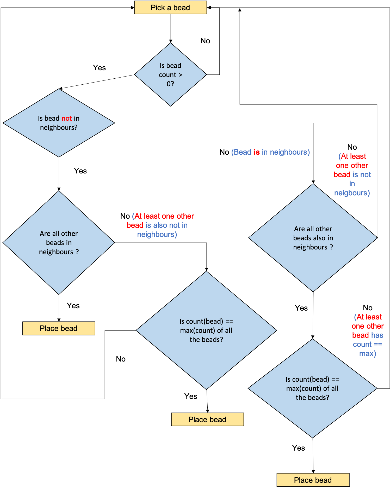

```{r echo = FALSE, results='hide'}
knitr::opts_chunk$set(tidy = TRUE)
getwd()
```

# Approach

The following flowchart shows the decision-making process employed while placing the beads.



In short, the criteria for placing a bead in a cell, in decreasing order of priority are:

1. The remaining count of the bead should be above 0. If not, consider another bead.
2. The cell's four neighbours should not have the same bead colour as the bead under consideration. If the current bead is the only one that fulfills this criteria, place it.
3. If multiple beads exist that fulfill criteria 2, check if the remaining count of the current bead is equal to the maximum of the remaining count of all the beads. If so, place the bead. If not, consider another bead.
4. If the current bead does not fulfill criteria 2, and there remains no other bead that fulfills criteria 2 (i.e., not having the same colour as those the cell's neighbours), check if the count of the bead under consideration is equal to the maximum of the remaining count of all the beads. If so, place the bead. If not, consider another bead.

# Code walkthrough


```{r echo = TRUE, results='hide'}
library(tidyverse)
```


## Creating a test matrix and storing the bead counts

```{r}
L <- 5
test.mat <- matrix(data = rep("X", times = L^2), nrow = L, ncol = L)
test.mat
```

For test purposes, there are three bead colours: Red, Blue and Green. Counts are as below.

```{r}
bead.counts <- c("R" = 8, "B" = 7, "G" = 10)
print(bead.counts)
sum(bead.counts)
```


## Defining function to get neighbours bead colours according to 4-connectivity

This function takes as input a matrix `x` and the co-ordinates of a point $(i, j)$ as `i` and `j` respectively. It then endeavours to find its four neighbours according to the four-neighbour connectivity criteria. It returns a character vector `n.collection` containing the bead colours of the four neighbours.

```{r }
find.n.beads <- function(x, i, j){

  n.collection <- vector(mode = "character")
  
  # same column next row
  n1_i <- i + 1
  n1_j <- j

    if(n1_i <= nrow(x)){
      n.collection <- c(n.collection, "b" = x[n1_i, n1_j])
    }
    
  # same column previous row
    n2_i <- i -1
    n2_j <- j 
    
    if(n2_i  >= 1){
      n.collection <- c(n.collection, "t" = x[n2_i, n2_j])
    }
    
  # same row next column
    n3_i <- i
    n3_j <- j + 1

    if(n3_j  <= ncol(x)){
        n.collection <- c(n.collection, "r" = x[n3_i, n3_j])
    }
    
    # same row previous column
    n4_i <- i
    n4_j <- j - 1 
    
    if(n4_j  >= 1){
        n.collection <- c(n.collection, "l" = x[n4_i, n4_j])
    }
    return(n.collection)
}
```

"b", "t", "r", "l" correspond to bottom, top, right and left neighbours respectively.

```{r}
find.n.beads(test.mat, 2, 3)
```


## Defining function to place beads

### Actual function

The following function implements the previously-described recipe for bead placement. It takes as arguments a matrix `x` and a named vector of bead counts called `counts`. Its output is a matrix with the beads placed.

```{r}
place.beads <- function(x, counts){
  for(i in 1:nrow(x)){
    for(j in 1:ncol(x)){
      n.collection <- find.n.beads(x, i, j)
      previous.bead <- ""     # initialising variable
      for(bead in names(counts)){
        if(bead == previous.bead){ # if bead is the same as the previously-placed bead, skip
          break
        } else {
          if(counts[bead] > 0){ # if bead count > 0
          counts.subset1 <- counts[counts > 0]  # all beads with bead count > 0
          if(!bead %in% n.collection){ # if bead is not in neighbours
            counts.subset2 <- counts.subset1[!names(counts.subset1) %in% n.collection] # all beads which are not in neighbours
            if(length(counts.subset2) == 1){ # if bead is the only remaining bead which has count different from neighbours
              x[i, j] <- bead # place bead
              counts[bead] <- counts[bead] - 1 # decrease the count of the placed bead
              break
            }else if(length(counts.subset2) > 1){  #at least one other bead has colour different from neighbours
              if(counts.subset2[bead] == max(counts.subset2)){ # If count of bead == max count of remaining bead (even if there are multiple beads with max count, it is acceptable)
                x[i, j] <- bead # place bead
                counts[bead] <- counts[bead] - 1 # decrease the count of the placed bead
                break
              }else{ # If count of bead != max count of remaining beads, move on to the next bead
                next
              }
            }
          }else if(bead %in% n.collection){# bead IS in neighbours
            counts.subset2 <- counts.subset1[!names(counts.subset1) %in% n.collection] # all beads which are not in neighbours
            if(length(counts.subset2) == 0){ # If all beads including the current one, are same as neighbours; there is no other bead remaining which is different from neighbours 
              if(counts.subset1[bead] == max(counts.subset1)){  # If count of bead = max count of bead (even if there are multiple beads with max count, it is acceptable)
                x[i, j] <- bead # place bead
                counts[bead] <- counts[bead] - 1 # decrease the count of the placed bead
                break
              }
            }
          }
        }else{
          next
        }
        }
      }
    }
  }
  return(x)
}
```


### Verbose function

The following function is a more verbose version of `place.beads` contains various print statements which allow tracking of the process in real time. For demonstration purposes only.

```{r}

place.beads.verbose <- function(x, counts){
  print(counts)
  for(i in 1:nrow(x)){
    for(j in 1:ncol(x)){
      print(paste("i", i, "j", j))
      print(paste("index", (ncol(x)*(i-1) + j)))
      n.collection <- find.n.beads(x, i, j)
      # print(n.collection)
      previous.bead <- ""
      # initialising variable
      for(bead in names(counts)){
        if(bead == previous.bead){ # if the bead is the same as the previously-placed bead, skip
          print(paste("previous.bead", previous.bead))
          print(paste("bead", bead))
          break
        } else {
          print(paste("bead", bead))
          if(counts[bead] > 0){ # if bead count > 0
            counts.subset1 <- counts[counts > 0]  # all beads with bead count > 0
            # print("counts.subset1")
            # print(counts.subset1)
            if(!bead %in% n.collection){ # if bead is not in neighbours
              counts.subset2 <- counts.subset1[!names(counts.subset1) %in% n.collection] # all beads which are not in neighbours
              # print("counts.subset2[bead]")
              # print(max(counts.subset2))
              if(length(counts.subset2) == 1){ # if bead is the only remaining bead which is not in neighbours
                print("condition path 1 fulfilled; bead is uniquely not in neighbours")
                x[i, j] <- bead # place bead
                counts[bead] <- counts[bead] - 1
                previous.bead = bead
                break
              }else if(length(counts.subset2) > 1){  #at least one other bead is not in neighbours
                if(counts.subset2[bead] == max(counts.subset2)){ # is count of bead = max count of bead (even if there are multiple beads with max count, it is acceptable)
                  print("condition path 2 fulfilled; bead is not in neighbours and max")
                  x[i, j] <- bead # place bead
                  counts[bead] <- counts[bead] - 1
                  previous.bead = bead
                  break
                }else{
                  next
                }
              }
            }else if(bead %in% n.collection){# bead IS in neighbours
              counts.subset2 <- counts.subset1[!names(counts.subset1) %in% n.collection] # all beads which are not in neighbours
              if(length(counts.subset2) == 0){ # all beads including the current one, are in neighbours; there is no other bead remaining which is not in neighbours 
                if(counts.subset1[bead] == max(counts.subset1)){  # is count of bead = max count of bead (even if there are multiple beads with max count, it is acceptable)
                  print("condition path 3 fulfilled; bead is in neighbours and max")
                  x[i, j] <- bead # place bead
                  counts[bead] <- counts[bead] - 1
                  previous.bead = bead
                  break
                }
              }
            }
          }else{
            next
          }
        }
        
      } # end of bead loop
      print(x)
      print(counts)
    }
  }
  return(list("x" = x, "counts" = counts))
}


```


### Implementing function on test matrix


```{r}
place.beads(x = test.mat, counts = bead.counts)
```


Looking at the verbose version.

```{r}
place.beads.verbose(x = test.mat, counts = bead.counts)
```


# Actually solving question 5

## Question 5.1

Initialising matrix and bead counts.

```{r}
L <- 5
first.mat <- matrix(data = rep("X", times = L^2), nrow = L, ncol = L)
first.mat
```


```{r}
first.bead.counts <- c("R" = 12, "B" = 13)
print(first.bead.counts)
sum(first.bead.counts)
```

Placing the beads.

```{r}
first.mat.placed <- place.beads(x = first.mat, counts = first.bead.counts)
first.mat.placed
```

Writing to file.
`
```{r}
write_delim(x = as.data.frame(first.mat.placed), path = "./Question 5/output question_5_1", delim = " ", col_names = FALSE)
```


## Question 5.2

Initialising matrix and bead counts.

```{r}
L <- 64
second.mat <- matrix(data = rep("X", times = L^2), nrow = L, ncol = L)
head(second.mat)
```


```{r}
second.bead.counts <- c("R" = 139, "B" = 1451, "G" = 977, "W" = 1072, "Y" = 457)
print(second.bead.counts)
sum(second.bead.counts)
64^2
```


Placing the beads.

```{r}
second.mat.placed <- place.beads(x = second.mat, counts = second.bead.counts)
```

```{r}
second.mat.placed[1:10, 1:10]
```

Writing to file.
`
```{r}
write_delim(x = as.data.frame(second.mat.placed), path = "./Question 5/output question_5_2", delim = " ", col_names = FALSE)
```

